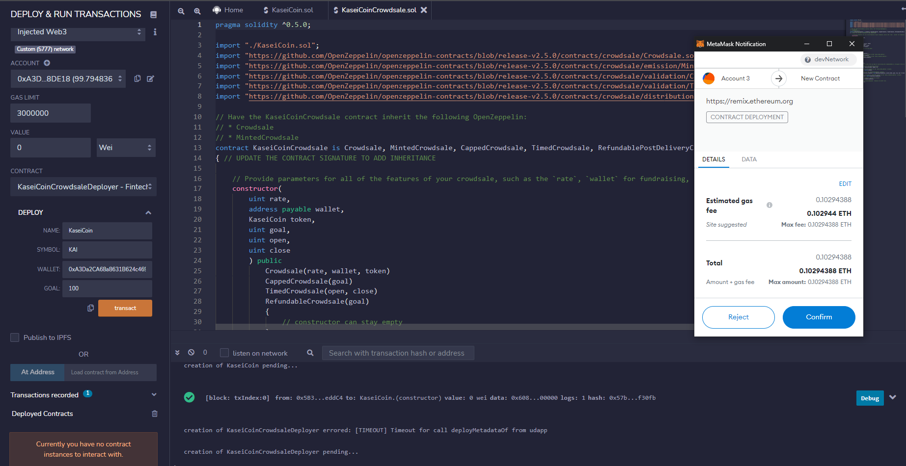

# ERC20KaseiCoin Mintinng and Crowd sale

Minting a Kasei Coin to be used on Mars using ERC20 and Crowdsale

##### Deployed the KaseiCoin constructor Compilation

##### Deployed the KaseiCoinCrowdsale constructor Compilation

##### Deploying the Deployer contract

##### Deployed the Deployer contract

##### Deployed the KaseiCoinCrowdsale contract

##### Deployed all the contract

##### Buying 5 tokens

##### Goal Reached

